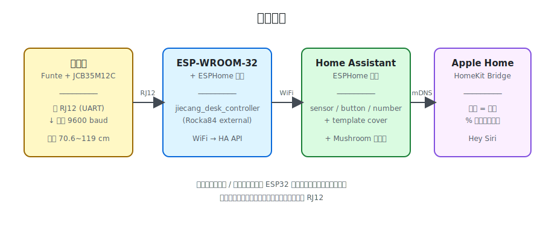
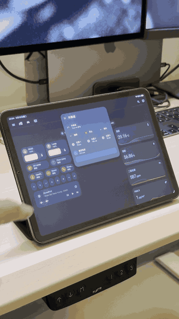
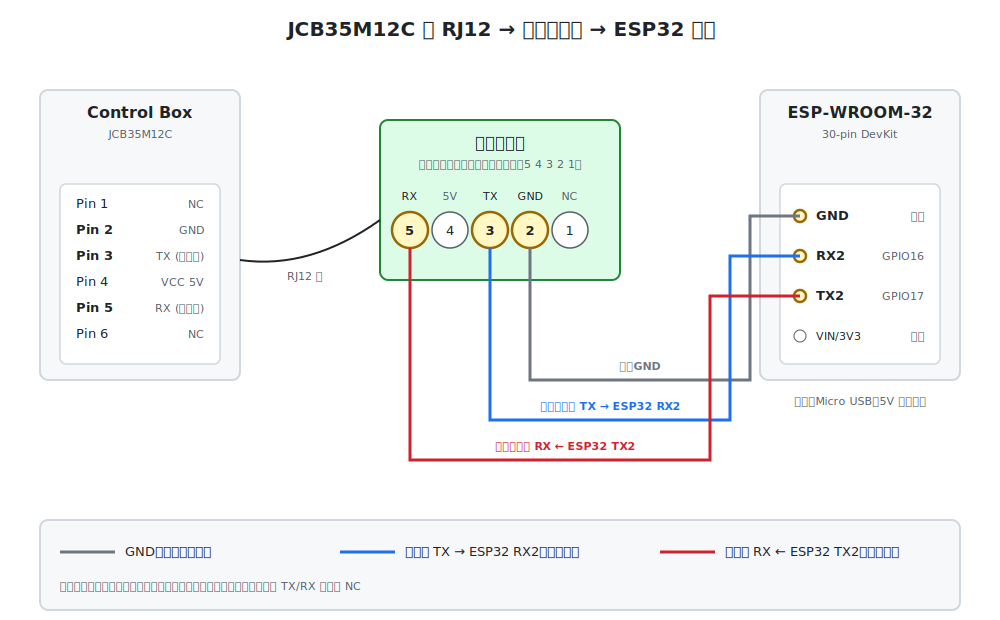
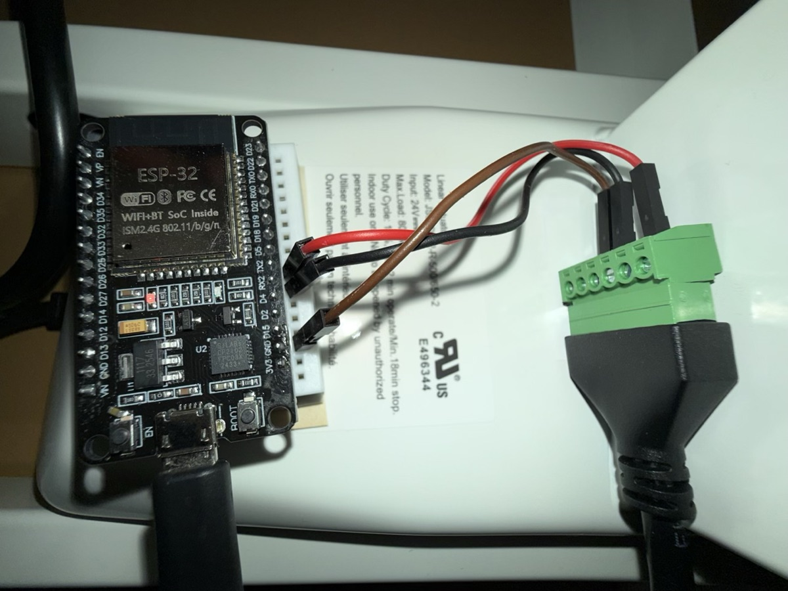
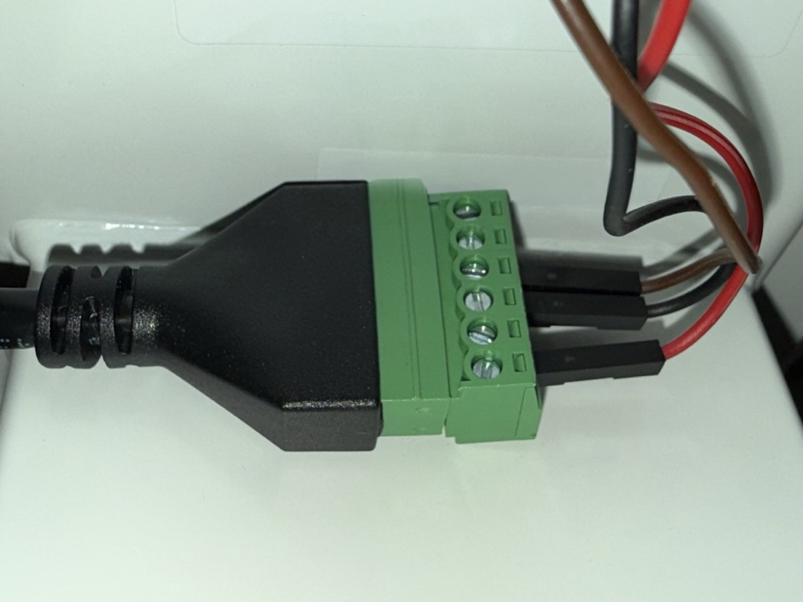
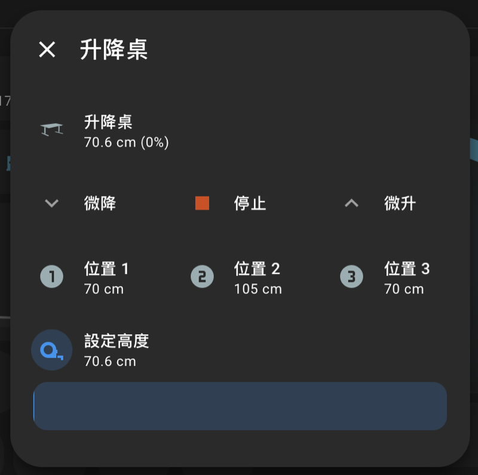
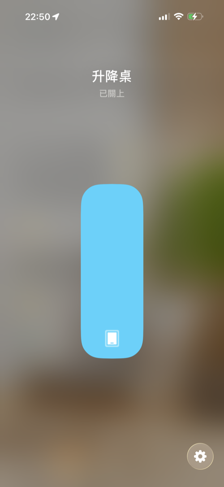
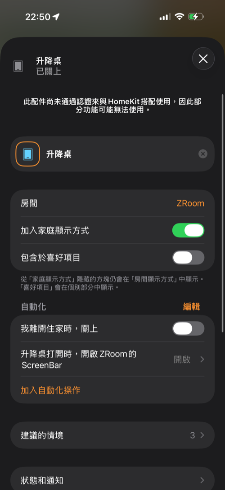

# Funte 升降桌智慧化：ESP32 + ESPHome + Home Assistant + Apple Home

把 **Funte 升降桌**（Jiecang **JCB35M12C** 控制器）透過 ESP32 接進 **Home Assistant**，並進一步以 template cover 包裝後丟給 **Apple Home**，用 iPhone / Siri 控制坐站切換、設定高度。

> **不需要拆桌、不需要破壞原廠手控器線。** 只用控制盒上原本閒置的副 RJ12 接孔即可。



## 成品



- HA 上有完整的 Mushroom 控制面板（升 / 降 / 停止 / 微調 / 記憶位置 / 高度滑桿）
- Apple Home 把桌子顯示成「窗簾」，垂直滑桿直接拖到目標高度
- Siri：「Hey Siri，把升降桌設成 80%」→ 桌子自動跑到對應高度
- 高度即時回報、可寫入自動化（例如「久坐自動站起」）

## 硬體需求（BOM）

| 零件 | 規格 / 備註 | 數量 |
|------|-------------|------|
| 升降桌 | Funte（搭載 **JCB35M12C** 控制盒，有閒置副 RJ12 孔）| 1 |
| 開發板 | ESP-WROOM-32 30-pin DevKit | 1 |
| Micro USB 線 | 給 ESP32 供電 | 1 |
| 杜邦線 | 公對母約 3 條（GND / RX / TX）| 3 |
| RJ12 線 | 視你拿到的綠色端子台轉接器規格 | 1 |
| 邏輯電平轉換器 *(選配)* | TXS0108E / BSS138 模組，3.3V ↔ 5V | 1 |

> **關於 level shifter**：ESP32 是 3.3V GPIO，控制器走 5V TTL。**理論上應該裝**，實測直接接也能跑（社群多數案例如此）；長期穩定性看自身可接受程度。本專案目前沒有裝，運作正常。

## 接線

### 副 RJ12 腳位（[Rocka84 README](https://github.com/Rocka84/esphome_components/tree/master/components/jiecang_desk_controller) 整理）

| Pin | 功能 |
|-----|------|
| 1 | NC |
| 2 | GND |
| 3 | 控制器 TX（送高度封包出來）|
| 4 | VCC +5V |
| 5 | 控制器 RX（接收升降指令）|
| 6 | NC |

### 綠色端子台 ↔ ESP32

桌控盒附的綠色端子台 **編號方向：從螺絲面（金屬面）的右邊起算為 1 號**。錯邊數會搞錯一晚上（親身經歷）。



| 綠色端子台 | RJ12 對應 | ESP32 腳位（板上絲印）|
|------------|-----------|---------------------|
| 2 | Pin 2 GND | **GND** |
| 3 | Pin 3 控制器 TX | **RX2** (GPIO16) |
| 5 | Pin 5 控制器 RX | **TX2** (GPIO17) |
| 4 (VCC 5V) | Pin 4 | **不接** |

供電走 ESP32 的 Micro USB（電腦 / 充電器 / 行動電源 5V/500mA+ 即可）。

### 實機接線參考

整體接線一覽：



綠色端子台特寫（螺絲面方向，作為腳位編號起算依據）：



## ESPHome 韌體

在 Home Assistant 上安裝 **ESPHome Builder** 附加元件，新建裝置，把整份 [esphome/desk.yaml](esphome/desk.yaml) 貼進去（保留 Builder 自動生成的 `api: encryption: key:` 跟 `ota: password:`）。

關鍵設定：

```yaml
external_components:
  - source:
      type: git
      url: https://github.com/Rocka84/esphome_components/
    components: [ jiecang_desk_controller ]

uart:
  tx_pin: GPIO17   # 板上絲印 TX2 → 接 RJ12 Pin 5 (控制器 RX)
  rx_pin: GPIO16   # 板上絲印 RX2 → 接 RJ12 Pin 3 (控制器 TX)
  baud_rate: 9600

jiecang_desk_controller:
  id: my_desk
  sensors:
    height:
      name: Height
    # ... 其餘 sensor / button / number
```

> 注意：**所有實體名稱用英文**。中文字會被 ESPHome ID 產生器轉成全部底線 `____`，多個實體 ID 撞名導致編譯失敗。HA 那邊還是可以單獨改成中文 friendly name，不影響 ID。

第一次燒錄需要透過 USB：在 ESPHome Builder 點 INSTALL → Manual download → `.bin` → 用 Chrome 開 [web.esphome.io](https://web.esphome.io) → USB 連接 ESP32 → 上傳 bin。之後 OTA 無線燒錄即可。

## Home Assistant 整合

ESP32 上線後 HA 會自動發現裝置，按「加入」即可。會多出這些實體：

- `sensor.standing_desk_height`（目前高度，cm）
- `sensor.standing_desk_height_pct`（百分比）
- `sensor.standing_desk_height_min` / `_max`（出廠限位）
- `sensor.standing_desk_position_1~4`（記憶位置）
- `number.standing_desk_set_height`（設定高度）
- `button.standing_desk_move_up` / `_down` / `_stop`
- `button.standing_desk_step_up` / `_down`（每按一次 ~14 mm）
- `button.standing_desk_goto_position_1~4`
- `button.standing_desk_save_position`

### 前置：建立 binary_sensor 判斷坐 / 站

popup 版面板會根據桌子是否升起來切換圖示與顏色，需要一顆 template binary sensor 判斷「桌面有沒有大於最低高度」。把以下接到 `configuration.yaml` 的 `template:` 區塊（跟 cover 同一塊也可以）：

```yaml
template:
  - binary_sensor:
      - name: Standing Desk Men
        unique_id: standing_desk_men
        state: "{{ states('sensor.standing_desk_height') | float(0) > 70.6 }}"
```

重啟 HA 後會有 `binary_sensor.standing_desk_men`（站立時 on、坐姿時 off）。

> 如果只用 [panel.yaml](homeassistant/dashboard/panel.yaml) 而不用 popup 版，可以跳過這步。

### Mushroom 儀表板

需先在 HACS 安裝 [Mushroom](https://github.com/piitaya/lovelace-mushroom)。

兩個版本：

- [homeassistant/dashboard/panel.yaml](homeassistant/dashboard/panel.yaml) — 完整面板（一直顯示）
- [homeassistant/dashboard/panel-popup.yaml](homeassistant/dashboard/panel-popup.yaml) — 收成一顆按鈕，點開才跳 popup（需另裝 [Browser Mod](https://github.com/thomasloven/hass-browser_mod) 與 [button-card](https://github.com/custom-cards/button-card)，加上上面的 binary sensor）

popup 打開後：



## Apple Home 整合（用 cover 包裝）

關鍵思路：HomeKit 沒有「桌子」這個設備類型，但**窗簾（cover / shade）的 UI 剛好是垂直滑桿**，跟桌子高度概念相同。把桌子包成 `cover.standing_desk`，0% = 70.6 cm（坐姿）、100% = 119 cm（站立），暴露到 HomeKit Bridge 就完事。

把 [homeassistant/configuration.yaml.example](homeassistant/configuration.yaml.example) 裡的 `template:` 區塊併進你的 `configuration.yaml`：

```yaml
template:
  - cover:
      - name: 升降桌
        unique_id: standing_desk_cover
        device_class: shade
        position: >-
          
          {{ ((h - 70.6) / (119 - 70.6) * 100) | round(0) }}
        open_cover:
          - action: button.press
            target:
              entity_id: button.standing_desk_move_up
        close_cover:
          - action: button.press
            target:
              entity_id: button.standing_desk_move_down
        stop_cover:
          - action: button.press
            target:
              entity_id: button.standing_desk_stop
        set_cover_position:
          - action: number.set_value
            target:
              entity_id: number.standing_desk_set_height
            data:
              value: "{{ position / 100 * (119 - 70.6) + 70.6 }}"
```

重啟 HA → 新增 **HomeKit Bridge** 整合 → 勾選 `cover.standing_desk` → 用 iPhone 家庭 App 掃 QR Code 配對。

完成後在 Apple Home 看起來就是一張「升降桌」窗簾卡片：

- 點開 → 全螢幕垂直滑桿
- 拖到 50% → 桌子自動跑到 94.8 cm
- 「Hey Siri，把升降桌打開」→ 升到最高
- 「Hey Siri，關掉升降桌」→ 降到最低

<table>
  <tr>
    <td></td>
    <td></td>
  </tr>
  <tr>
    <td align="center"><sub>窗簾風格的垂直滑桿</sub></td>
    <td align="center"><sub>配件設定 / 加入自動化</sub></td>
  </tr>
</table>

## 疑難排解

| 症狀 | 可能原因 | 解法 |
|------|---------|------|
| HA 看得到高度但按鈕沒反應 | 端子台「3 / 5 號孔」誰是 RX 數錯方向 | 從螺絲面**右邊**起算才是 1 號 |
| 編譯時報「Duplicate sensor entity」 | 用中文 entity 名 → ASCII ID 變一堆底線撞名 | 改用英文 `name`，HA 上再改 friendly name |
| 高度跳動正常但 OTA 後連不上 | UART logger 跟 jiecang 共用 UART | 用 UART2 (GPIO16/17) 即可，不要用 GPIO1/3 |
| Mushroom 觸發 Browser Mod popup 沒反應 | mushroom-template-card 對 `fire-dom-event` 有時失效 | 外層改用 `tile` 或 `custom:button-card` |
| Apple Home 拖滑桿桌子沒動 | `number.set_value` 沒被觸發 | 檢查 entity_id 是否真的叫 `number.standing_desk_set_height` |

## 致謝與來源

本專案站在前人肩上：

- **[Rocka84/esphome_components](https://github.com/Rocka84/esphome_components)** — `jiecang_desk_controller` ESPHome 元件，本專案核心依賴
- **[phord/Jarvis](https://github.com/phord/Jarvis)** — 反向工程 Jiecang UART 協定的原始來源
- **[pimp-my-desk/desk-control](https://gitlab.com/pimp-my-desk/desk-control)** — 收集各種 Jiecang 控制器資訊
- **[ESPHome](https://esphome.io/)** — 燒韌體與 HA 整合的基礎建設
- **[Home Assistant](https://www.home-assistant.io/)** — Template Cover / HomeKit Bridge 文件
- **[Mushroom](https://github.com/piitaya/lovelace-mushroom)** — Lovelace 卡片風格
- **[Browser Mod](https://github.com/thomasloven/hass-browser_mod)** — HA popup 解決方案
- **[custom-cards/button-card](https://github.com/custom-cards/button-card)** — Dashboard 卡片動態圖示與顏色
